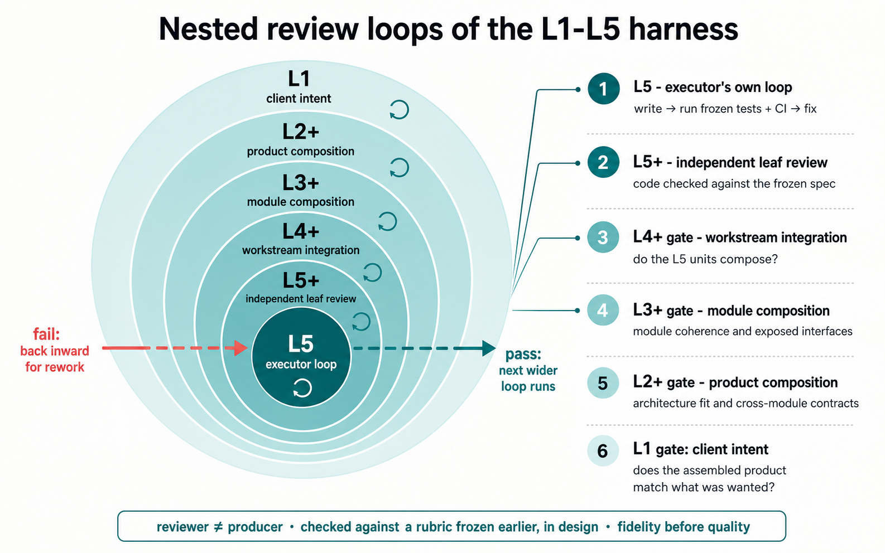

# long-horizon-agentic-harness

> An architecture for building software with AI over long horizons. Work is split across five levels, each owning a different kind of decision, and each level's output is checked against criteria fixed before the work.

Pre-v1, in active development. The design is finished and the initial implementation is largely done; the runtime runs supervised builds, though not yet reliably enough for unattended real work. This README describes what is built and where it is going — ongoing work, not a finished system.

## What it is

Current models write good code but lose coherence over long, multi-step work: the build drifts from what was asked, a single agent cannot hold a whole project in context at once, decomposition stays shallow, and an agent checking its own work tends to pass it. This project addresses that with structure around the models rather than better prompts. The models are treated as interchangeable; the design is in how work is divided, how state is kept, and where it is checked.

The structure is taken from how an engineering organization delivers for a client: work is split across five levels, each responsible for a different kind of decision, and each level's output is reviewed before the level above accepts it.

## The five levels

A single agent taking a project from request to finished code would have to hold, at once, the request, the architecture, every module's design, every task, and the code. It cannot, and over a long run it loses track of whether the code still matches the request. So the work is split across five levels. Each is a different kind of decision, and each holds one artifact — its definition of what "correct" means at that level — and works only on it.

- **L1 — System Orchestrator.** The level the user talks to. It works out what the user wants (including probing tradeoffs to find where the user has firm preferences and where they will defer), records it as a tagged intent-spec, and holds that spec for the life of the project. It routes work, and when results return it presents them to the user and checks the finished product against the original request. Holds the intent-spec.
- **L2 — Project Architect.** Decides the structure: module boundaries, the interfaces between modules, and the choices that are costly to change later. It stops there and leaves each module's internals to L3, with constraints. On the way back it checks that the finished modules fit together. Holds the architecture — the module map, interface contracts, and decision records.
- **L3 — Module Designer.** Designs one module in detail, then oversees its construction. These are two different jobs and run as two separate instances: a planning instance produces the design (and pushes back on L2's interfaces where they do not work), then ends; a later instance takes the fixed design, splits it into workstreams, and runs them. Holds the module design.
- **L4 — Workstream Coordinator.** Splits a module into individual tasks. Before any code is written, a separate agent writes the acceptance tests each task must pass, working from the spec rather than the eventual code. L4 hands each task down with its tests and checks that the finished pieces integrate. Holds the workstream and its acceptance tests.
- **L5 — Task Executor.** Writes the code and makes the acceptance tests pass; it cannot change those tests. A separate reviewer, on a different model, reads the code against the spec and either accepts it or sends it back. Holds the code.

Each level does the same two things and nothing else: going down, it turns its artifact into a more detailed spec and fixed criteria for the level below; coming up, it checks the level below's work against those criteria and passes a summary up. It is the same plan / execute / review step at every level, so the L1–L2 relationship has the same shape as the L4–L5 one. A level decides only what its own artifact covers — it does not change the intent above it or the implementation below it.

## How it works

Work runs as two passes with one gate between them.

The **design pass** produces a plan and no code. L1 turns the request into a tagged spec; L2 proposes the structure; the module designers detail each area and settle the interfaces between them. The acceptance tests and review criteria are written during this pass, from the spec, by agents other than the ones who will later do the work, and then fixed.

Between the passes is the **plan-alignment gate**. It checks the whole assembled plan against the original request — for dropped requirements, added scope, and requirements that are present but wrong — including the step where the user's prose was first turned into requirements. It ends with a human sign-off, and the build pass does not start until it passes.

The **build pass** writes code against the fixed plan and tests. Each level's output is reviewed at its own level before it moves up: the code at the line, each level above for how its parts fit together, the top against the original request.

## Two views

Two diagrams of the same system. The first is the flow of work — instructions down, reviewed results up. The second is the review structure drawn as nested loops.

```
                    ┌──────────────────────────┐
           intent ─▶│            USER          │◀─ deliverable
                    └─────────────┬────────────┘
                                  ▲ L1 gate: the user judges the
                                  │ finished product against intent
                    ┌─────────────┴────────────┐
                    │ L1 · System Orchestrator │  guards intent, routes work
                    └─────────────┬────────────┘
               brief ▼            │            ▲ review-gated report (never raw)

   ═══════════════ DESIGN CYCLE · produces a validated PLAN, never code ═══════

        ┌────────────────┐
        │ L2 · Architect │  module map + interface contracts + ADRs
        └───────┬────────┘
            ┌───┴────┬────────┐         ×N areas, planned in parallel
        ┌───▼──┐ ┌───▼──┐ ┌───▼──┐
        │L3 #1 │ │L3 #2 │ │L3 #3 │  deep area design; renegotiate interfaces up,
        │ plan │ │ plan │ │ plan │  then collapse — the design is an output
        └───┬──┘ └──────┘ └──────┘
        ┌───▼────────┐
        │ L4 · tester│  writes acceptance tests FROM the spec, before any
        │     ×N     │  code, by ≠ the coder  ───────────────────▶  FROZEN
        └────────────┘
        · · walking skeleton: an ungated spike, proves the wiring · ·
        every level FREEZES the pass-conditions for the level below ──┐
                                                                      │
   ╔══════════════════════════════════════════════════════════════════▼════════╗
   ║  PLAN-ALIGNMENT GATE — the one hard checkpoint                            ║
   ║  whole plan ⟷ tagged intent: coverage · prose→ID atomization ·            ║
   ║  two-window blind reconstruction · adversarial compare · + human sign-off ║
   ╚════════════════════════════════╤══════════════════════════════════════════╝
                       PASS ⇒ unlock │  (no execution-L3, no code, until PASS)

   ═══ BUILD CYCLE · begins only on PASS ═════════════════════════════════════

   CASCADE DOWN · briefs flow down (what, not how); work fans out every level

        ┌────────────────┐
        │ L2 · Architect │
        └───────┬────────┘
            ┌───┴────┬────────┐  ×N areas
        ┌───▼──┐ ┌───▼──┐ ┌───▼──┐
        │L3 #1 │ │L3 #2 │ │L3 #3 │  execution-L3 — owns the frozen design
        └───┬──┘ └──────┘ └──────┘
        ┌───▼──┐ ┌──────┐  each L3 → many L4 workstreams
        │L4 #1 │ │L4 ×N │
        └───┬──┘ └──────┘
        ┌───▼──┐ ┌──────┐  each L4 → many L5 tasks; the executor writes
        │L5 #1 │ │L5 ×N │  code and makes the frozen acceptance tests
        └──────┘ └──────┘  pass (it cannot edit them)

   CASCADE UP · each output is reviewed at a gate, then climbs to its parent
                reviewer ≠ producer · vs the FROZEN rubric · fidelity-first

        ┌────────────┐
        │  L5 gate   │  independent leaf review: unit + CI
        └─────┬──────┘  reject ↺ bounces to L5 (bounded; L5 keeps context)
              │ accept → up to L4
        ┌─────┴──────┐
        │  L4 gate   │  workstream integration: units compose? contracts hold?
        └─────┬──────┘
              │ up to L3
        ┌─────┴──────┐
        │  L3 gate   │  module composition: area coherence; exposed interfaces
        └─────┬──────┘
              │ up to L2
        ┌─────┴──────┐
        │  L2 gate   │  product composition: system integration; architecture fit
        └─────┬──────┘
              │ up to L1
        ┌─────┴──────┐
        │  L1 gate   │  client intent: the user judges the product vs the intent
        └────────────┘

   ───────────────────────────────────────────────────────────────────────────
   ONE SPINE · one path = requirement-ID = agent address = workspace = git
   branch = rubric file = read-visibility. Decided once; everything keys off it.
```



The review structure: the executor's test loop is at the center; each ring out is a review at a higher level, against criteria fixed earlier. Passing a review moves the work outward to the next one; failing sends it back in.

## Design choices

- **Built for long horizons.** The target is work that runs longer than one context window or session. Each level holds only its own slice of the problem, the criteria for each piece are fixed before the work and cannot be moved to fit it, and state lives in files so any agent can be stopped and restarted from its documents. The failure being designed against is drift over a long run, not a single wrong answer.
- **Boundaries where change is isolated.** A project is carved where the interfaces between parts are thin — where the least has to cross — so a later change tends to land inside one part and stop at its boundary. Each level owns the decisions inside its boundary and none outside it.
- **Automated decomposition by method, not by taste.** Splitting a project into modules, workstreams, and tasks follows an explicit method rather than improvisation: C4 altitudes (system → container → component), DDD seam-finding (cut where the language shifts and things change together), a spec-driven (SDD) chain that ties a requirement ID from intent down to code, and hexagonal ports for the interfaces. Ousterhout's "deep modules" is used to check a carving, not to generate one.
- **Review at every boundary, by a different agent.** Each level's output is checked by a separate reviewer — not the agent that produced it — against criteria fixed before the work, with agreement to spec weighted above code quality.
- **Tests before code, by a different agent.** Acceptance tests are written from the spec, before the code, by someone other than the coder, then fixed. In one simulated run an executor passed all 17 tests while taking a value from the wrong source; the tests did not assert the source, and only the independent reviewer caught it.
- **One naming scheme.** A single hierarchical path is the requirement ID, the agent's address, the workspace path, the git branch, the rubric location, and the read-visibility graph.
- **Multiple models.** Different models are assigned per level and are swappable; failures escalate up a level rather than being absorbed.
- **Walking skeleton first.** A thin end-to-end thread is built before the full build, to check the connections.

## What's built

The design is hardened against a full simulated run, and the runtime is largely built. It runs supervised builds: a daemon starts the levels on pinned agent CLIs, tracks them through their transcripts, and enforces three checks — an agent is not started without the inputs it needs, a task is not accepted without its report and traceability, and nothing is delivered without a confirmed destination. Early runs have produced working software end to end, including the review-and-resend loop running without intervention. It is not yet reliable across varied real work without supervision; that is the bar for v1. The commit history is the build log.

## Where it's going

Next is behavioural tuning, evaluation, and continued development.

- **Immediate:** improve per-run monitoring; introduce self-improvement capabilities; construct and identify suitable benchmarks.
- **Medium term:** more decomposition; micro-level code-quality improvements; further parallelization; a GUI.
- **Longer term:** efficiency and cost improvements; finding the current bottlenecks; stronger per-component measurement and eval suites.

v1 is when it runs varied real work reliably without hand-holding.

## Repository layout

This repository holds both the specification corpus and the runtime built from it.

```text
design/         the specification corpus: architecture, principles, and the
                mechanism docs (plan-alignment gate, decomposition, quality gate,
                observability, communication, workspace schema, improvement workspace),
                plus working notes: live-run findings, adherence audits, session logs
operational/    what each agent loads at spawn: L1–L5 and the L5+ reviewer (role,
                config, soul, spawn-template) and shared protocols (runtime-and-model
                map, agent-definition principles, lifecycle, comms, git, intent-spec
                contract, user-profile schema)
harnessd/       the runtime: a resident daemon that spawns and supervises the
                cascade in tmux — spawn chokepoint with per-runtime adapters
                (runtime-abstracted; swappable per level), liveness watchdog,
                return-contract walker, promote/intake gate, WAL-backed state store
tests/          the harness test suite
dry-run/        the end-to-end simulation: an intent-spec taken through L2
                (ADRs, contracts, plan), a walking skeleton, the plan-alignment
                gate report, and the built payments slice with its tests
research/       curated prior research, kept for reference
```

Entry points: `design/ARCHITECTURE.md` (the system design), `design/PLAN-ALIGNMENT-GATE.md` (the gate), `design/QUALITY-GATE.md` (the per-level review rules), `harnessd/daemon.py` (the runtime), and `dry-run/` (a worked example).

## Running the tests

The test suite is pure-Python and offline — no agent binaries, API keys, or network. Requires Python 3.11+ and PyYAML.

```bash
pip install pyyaml
python3 -m pytest tests/ -q      # 944 pass, 3 environment-gated skips
```

Driving a real build additionally needs the two pinned agent-CLI runtimes and tmux; the daemon (`harnessd/daemon.py`) spawns and supervises the levels across tmux sessions. `dry-run/` shows a full intent → gate → built-slice pass without standing any of that up.

## License

MIT — see [`LICENSE`](LICENSE). One exception: `research/reference/anthropic-soul-doc.md` is a third-party reference copy that carries its own provenance note and is not covered by this license.
